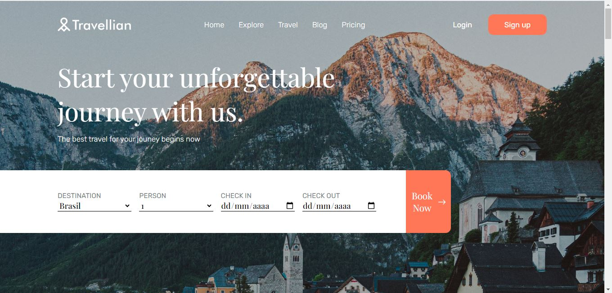

# Project Travel Company

### This project was designed to test my skills in creating layouts, based on a template available on Figma.

### In it I was able to deepen my knowledge of how to turn design into code, learning more about Grid layout, form creation, Responsive Design and animations in conjunction with Javascript.

## To see the project working click <a href="https://caiouser2.github.io/landing-page-travel-company/">aqui</a>.

